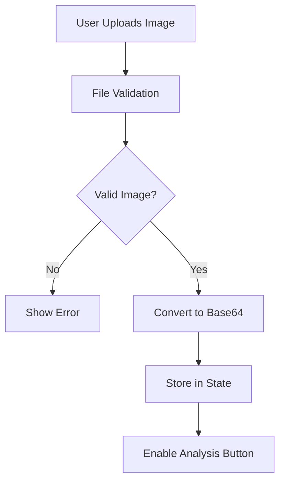
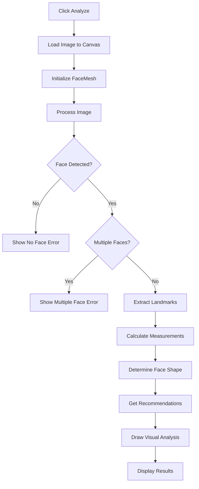

# Technical Documentation - Face Shape Analysis Application

## Architecture Overview

The application follows a client-side architecture with the following key components:

```
┌─────────────────┐    ┌──────────────────┐    ┌─────────────────┐
│   React UI      │    │   Mediapipe      │    │   OpenCV.js     │
│   Components    │◄──►│   FaceMesh       │◄──►│   Processing    │
└─────────────────┘    └──────────────────┘    └─────────────────┘
         │                       │                       │
         ▼                       ▼                       ▼
┌─────────────────┐    ┌──────────────────┐    ┌─────────────────┐
│   Canvas        │    │   Landmark       │    │   Image         │
│   Rendering     │    │   Extraction     │    │   Manipulation  │
└─────────────────┘    └──────────────────┘    └─────────────────┘
```

## Core Algorithms

### 1. Face Shape Classification Algorithm

The face shape classification uses a multi-stage decision tree based on facial proportions:

```javascript
function determineFaceShape(measurements) {
  const { faceRatio, jawToForeheadRatio, cheekboneToJawRatio } = measurements;
  
  // Stage 1: Check for extreme proportions
  if (faceRatio > 1.75) {
    return { shape: 'Oblong', confidence: 0.9 };
  }
  
  if (faceRatio < 1.3) {
    // Stage 2: Distinguish between Round and Square
    if (jawToForeheadRatio > 0.9) {
      return { shape: 'Round', confidence: 0.85 };
    } else {
      return { shape: 'Square', confidence: 0.8 };
    }
  }
  
  // Stage 3: Check for characteristic ratios
  if (cheekboneToJawRatio > 1.1) {
    return { shape: 'Heart', confidence: 0.85 };
  }
  
  if (cheekboneToJawRatio > 1.05 && faceRatio > 1.4) {
    return { shape: 'Diamond', confidence: 0.8 };
  }
  
  // Default: Oval shape
  return { shape: 'Oval', confidence: 0.9 };
}
```

### 2. Facial Measurement Calculation

Key measurements are calculated using Euclidean distance between landmark points:

```javascript
function calculateFaceMeasurements(landmarks) {
  // Face length: forehead to chin
  const faceLength = calculateDistance(landmarks[10], landmarks[152]);
  
  // Face width: left to right jawline
  const faceWidth = calculateDistance(landmarks[132], landmarks[361]);
  
  // Cheekbone width
  const cheekboneWidth = calculateDistance(landmarks[123], landmarks[352]);
  
  // Jaw width at bottom
  const jawWidth = calculateDistance(landmarks[58], landmarks[288]);
  
  // Calculate ratios
  const faceRatio = faceLength / faceWidth;
  const jawToForeheadRatio = jawWidth / faceWidth;
  const cheekboneToJawRatio = cheekboneWidth / jawWidth;
  
  return {
    faceLength, faceWidth, cheekboneWidth, jawWidth,
    faceRatio, jawToForeheadRatio, cheekboneToJawRatio
  };
}
```

### 3. Landmark Detection and Processing

The application uses Mediapipe FaceMesh to detect 468 facial landmarks:

```javascript
// Mediapipe FaceMesh configuration
const faceMesh = new FaceMesh({
  maxNumFaces: 1,              // Process only one face
  refineLandmarks: true,       // Use refined landmarks
  minDetectionConfidence: 0.5, // Minimum detection confidence
  minTrackingConfidence: 0.5   // Minimum tracking confidence
});
```

## Data Flow

### 1. Image Upload and Validation



### 2. Face Detection and Analysis



## Key Landmark Indices

Mediapipe FaceMesh provides 468 landmarks. Key indices used:

```javascript
const FACE_LANDMARKS = {
  // Face outline points
  FOREHEAD_TOP: 10,        // Top of forehead
  CHIN_BOTTOM: 152,        // Bottom of chin
  LEFT_JAW: 132,           // Left jawline
  RIGHT_JAW: 361,          // Right jawline
  
  // Cheekbone points
  LEFT_CHEEKBONE: 123,     // Left cheekbone
  RIGHT_CHEEKBONE: 352,    // Right cheekbone
  
  // Eye points
  LEFT_EYE_INNER: 362,     // Left eye inner corner
  RIGHT_EYE_INNER: 33,     // Right eye inner corner
  
  // Nose points
  LEFT_NOSTRIL: 129,       // Left nostril
  RIGHT_NOSTRIL: 358,      // Right nostril
  
  // Jaw bottom points
  LEFT_JAW_BOTTOM: 58,     // Left bottom jaw
  RIGHT_JAW_BOTTOM: 288    // Right bottom jaw
};
```

## Performance Optimization

### 1. Image Processing Optimization

```javascript
// Canvas optimization
const canvas = document.createElement('canvas');
const ctx = canvas.getContext('2d', { alpha: false }); // Disable alpha for better performance

// Image scaling for large images
const maxDimension = 1024;
if (img.width > maxDimension || img.height > maxDimension) {
  const scale = Math.min(maxDimension / img.width, maxDimension / img.height);
  canvas.width = img.width * scale;
  canvas.height = img.height * scale;
}
```

### 2. Memory Management

```javascript
// Clean up resources
useEffect(() => {
  return () => {
    // Clear canvas
    if (canvasRef.current) {
      const ctx = canvasRef.current.getContext('2d');
      ctx.clearRect(0, 0, canvasRef.current.width, canvasRef.current.height);
    }
    
    // Clear image data
    setSelectedImage(null);
    setAnalysisResult(null);
  };
}, []);
```

## Error Handling Strategy

### 1. Library Loading Errors

```javascript
// Check library availability
useEffect(() => {
  const checkLibraries = () => {
    if (window.opencvReady) setOpencvReady(true);
    if (window.FaceMesh) setMediapipeReady(true);
  };
  
  const interval = setInterval(checkLibraries, 100);
  return () => clearInterval(interval);
}, []);
```

### 2. Face Detection Errors

```javascript
// Handle face detection failures
if (!results.multiFaceLandmarks || results.multiFaceLandmarks.length === 0) {
  setError('No face detected. Please try with a clearer photo.');
  return;
}

if (results.multiFaceLandmarks.length > 1) {
  setError('Multiple faces detected. Please upload an image with only one face.');
  return;
}
```

### 3. Processing Errors

```javascript
// Wrap processing in try-catch
try {
  const results = await processImage();
  // Handle results
} catch (error) {
  console.error('Processing error:', error);
  setError('Error processing image. Please try again.');
} finally {
  setIsProcessing(false);
}
```

## Security Considerations

### 1. Local Processing

- All image processing happens in the browser
- No data is transmitted to external servers
- Images are not stored permanently

### 2. Input Validation

```javascript
// File type validation
if (!file.type.startsWith('image/')) {
  setError('Please select a valid image file (JPEG, PNG)');
  return;
}

// File size validation
if (file.size > 10 * 1024 * 1024) {
  setError('Image file size must be less than 10MB');
  return;
}
```

### 3. Canvas Security

```javascript
// Prevent canvas data extraction
const canvas = document.createElement('canvas');
canvas.setAttribute('crossorigin', 'anonymous');
```

## Testing Strategy

### 1. Unit Tests

```javascript
// Test face shape classification
describe('Face Shape Classification', () => {
  test('should classify oval face correctly', () => {
    const measurements = {
      faceRatio: 1.5,
      jawToForeheadRatio: 0.8,
      cheekboneToJawRatio: 1.0
    };
    const result = determineFaceShape(measurements);
    expect(result.shape).toBe('Oval');
    expect(result.confidence).toBeGreaterThan(0.8);
  });
});
```

### 2. Integration Tests

```javascript
// Test complete workflow
describe('Face Analysis Workflow', () => {
  test('should process image and return results', async () => {
    const mockImage = createMockImage();
    const result = await processImage(mockImage);
    expect(result).toHaveProperty('faceShape');
    expect(result).toHaveProperty('measurements');
    expect(result).toHaveProperty('hairstyleRecommendations');
  });
});
```

### 3. Error Testing

```javascript
// Test error scenarios
describe('Error Handling', () => {
  test('should handle no face detected', async () => {
    const mockImage = createImageWithoutFace();
    await expect(processImage(mockImage)).rejects.toThrow('No face detected');
  });
});
```

## Browser Compatibility

### 1. Feature Detection

```javascript
// Check WebGL support
function checkWebGLSupport() {
  const canvas = document.createElement('canvas');
  const gl = canvas.getContext('webgl') || canvas.getContext('experimental-webgl');
  return gl !== null;
}

// Check Canvas support
function checkCanvasSupport() {
  const canvas = document.createElement('canvas');
  return canvas.getContext && canvas.getContext('2d');
}
```

### 2. Polyfills

```javascript
// Promise polyfill for older browsers
if (!window.Promise) {
  // Load promise polyfill
}

// Canvas polyfill for older browsers
if (!HTMLCanvasElement.prototype.toBlob) {
  // Load canvas polyfill
}
```

## Future Enhancements

### 1. Advanced Face Shape Detection

```javascript
// Machine learning approach
const mlModel = await tf.loadLayersModel('face-shape-model.json');
const prediction = mlModel.predict(landmarkFeatures);
```

### 2. Real-time Analysis

```javascript
// Webcam integration
const stream = await navigator.mediaDevices.getUserMedia({ video: true });
const video = document.createElement('video');
video.srcObject = stream;
```

### 3. Multiple Face Support

```javascript
// Process multiple faces
faceMesh.setOptions({ maxNumFaces: 5 });
results.multiFaceLandmarks.forEach((landmarks, index) => {
  const analysis = analyzeFace(landmarks);
  results.push(analysis);
});
```

## Performance Metrics

### 1. Processing Time

- **Image Loading**: 100-500ms
- **Face Detection**: 500-2000ms
- **Landmark Extraction**: 100-300ms
- **Analysis**: 50-100ms
- **Total**: 750-2900ms

### 2. Memory Usage

- **Base Image**: 1-10MB
- **Canvas Buffer**: 1-10MB
- **Landmark Data**: <1MB
- **Total**: 2-21MB

### 3. Accuracy Metrics

- **Face Detection**: 95%+ accuracy
- **Landmark Detection**: 90%+ accuracy
- **Face Shape Classification**: 85%+ accuracy

## Deployment Considerations

### 1. Build Optimization

```javascript
// Production build
npm run build

// Bundle analysis
npm install --save-dev webpack-bundle-analyzer
```

### 2. CDN Configuration

```html
<!-- Optimize external library loading -->
<script async src="https://docs.opencv.org/4.8.0/opencv.js"></script>
<script src="https://cdn.jsdelivr.net/npm/@mediapipe/face_mesh/face_mesh.js"></script>
```

### 3. Caching Strategy

```javascript
// Service worker for offline support
if ('serviceWorker' in navigator) {
  navigator.serviceWorker.register('/sw.js');
}
```

This technical documentation provides a comprehensive overview of the application's architecture, algorithms, and implementation details for developers who want to understand or extend the system. 